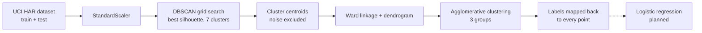

# Partial Data Clustering (PHCL-LR)

Research prototype combining density-based and hierarchical clustering, working toward a classifier for partial or incomplete data.

## Overview

PHCL-LR (Partial Data Hierarchical Clustering based on DBSCAN and Logistic Regression) is an in-progress algorithm aimed at classifying incomplete data. The idea is to find dense core clusters with DBSCAN, organize them into a hierarchy with agglomerative clustering, and eventually classify points with logistic regression. The notebooks in this repo implement the first two stages on the [UCI Human Activity Recognition (HAR)](https://archive.ics.uci.edu/dataset/240/human+activity+recognition+using+smartphones) dataset. The logistic regression stage and explicit handling of missing values are not implemented yet.

This work is part of ongoing doctoral research done with collaborators, so the approach may change.

## What's inside

- **Automatic dataset download**: both notebooks fetch and unzip the UCI HAR dataset if it isn't present, then merge the train and test feature sets (10,299 samples) and standardize them.
- **DBSCAN grid search** (`main_werk.ipynb`): sweeps `eps` from 1 to 99 and `min_samples` from 5 to 19, keeping the setting with the best silhouette score that yields exactly 7 clusters.
- **Hierarchy over DBSCAN clusters** (`main_werk.ipynb`): computes the centroid of each DBSCAN cluster, builds a Ward linkage and dendrogram over those centroids, groups them into 3 higher-level clusters, and maps the labels back to every data point.
- **Hierarchical clustering baseline** (`hierarchical_clustering.ipynb`): grid search over `n_clusters` (2-29) and linkage (`ward`, `complete`, `average`, `single`) for agglomerative clustering on the full dataset, scored by silhouette.

## Tech stack

Python, Jupyter, pandas, NumPy, scikit-learn (DBSCAN, AgglomerativeClustering, silhouette score), SciPy (linkage, dendrogram), Matplotlib, Seaborn.

## How it works



## Repository structure

```
Partial-Data-Clustering/
├── main_werk.ipynb               # DBSCAN -> centroids -> hierarchical clustering pipeline
├── hierarchical_clustering.ipynb # Agglomerative clustering grid search baseline
└── README.md
```

## Getting started

Requires Python 3 and an internet connection on the first run (the dataset is downloaded automatically).

```bash
git clone https://github.com/DJCodesStuff/Partial-Data-Clustering.git
cd Partial-Data-Clustering
python -m venv venv && source venv/bin/activate
pip install pandas numpy scikit-learn scipy matplotlib seaborn jupyter
jupyter notebook main_werk.ipynb
```

Note: the DBSCAN grid search runs about 1,500 fits over roughly 10k samples, and the hierarchical grid search runs over 100 fits, so expect both to take a while.

## Results

These results come from the saved outputs in `main_werk.ipynb`:

| Stage | Result |
|---|---|
| Best DBSCAN parameters | `eps=14`, `min_samples=13` |
| DBSCAN clusters | 7 (plus 3,255 noise points) |
| DBSCAN silhouette score | 0.144 |
| Cluster sizes | 5,125 / 1,791 / 36 / 34 / 25 / 20 / 13 |
| Hierarchical groups over centroids | 3 groups with 5,125 / 1,865 / 54 points |

`hierarchical_clustering.ipynb` has no saved outputs.

## Roadmap

- Add the logistic regression classification stage.
- Add explicit handling of incomplete (partial) data.
- Improve robustness on more complex datasets and expand the range of datasets tested.

## Author

**Dhruv Joshi** - [GitHub](https://github.com/DJCodesStuff) | [Portfolio](https://djcodesstuff.github.io/)
